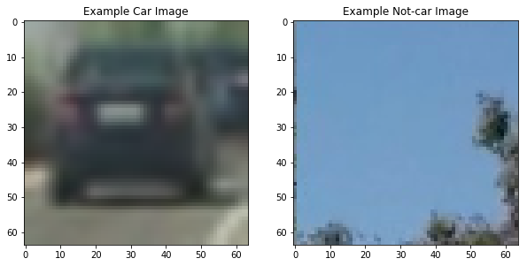
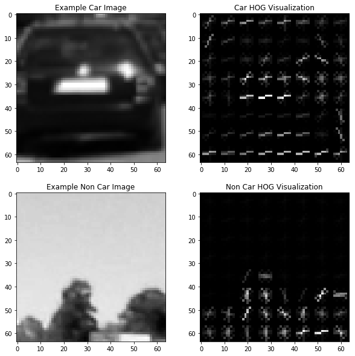
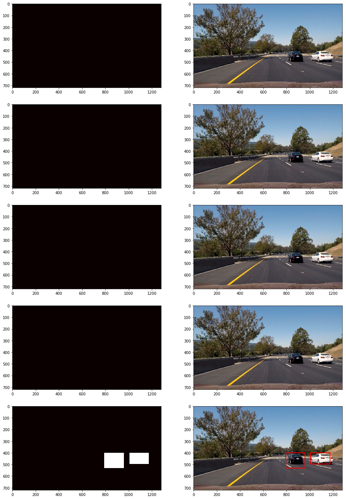
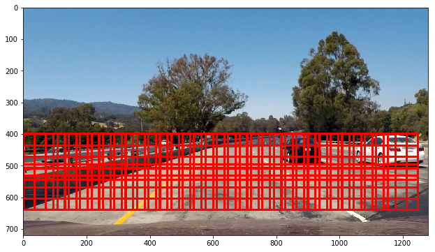
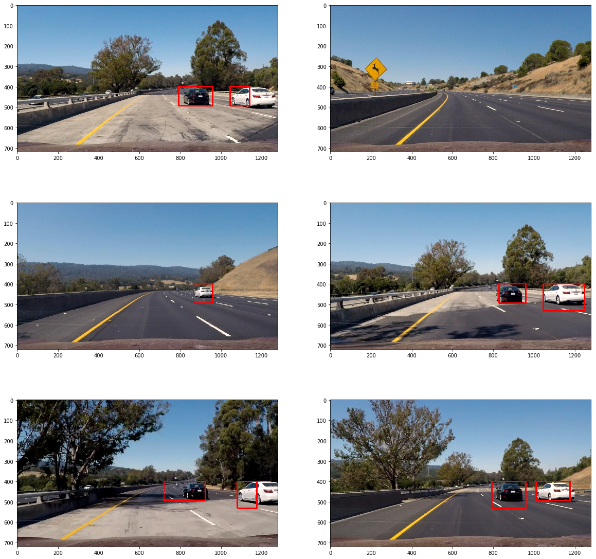

# Vehicle Detection Project Writeup

### The goals / steps of this project are the following:

* Perform a Histogram of Oriented Gradients (HOG) feature extraction on a labeled training set of images and train a classifier Linear SVM classifier
* Optionally, you can also apply a color transform and append binned color features, as well as histograms of color, to your HOG feature vector. 
* Note: for those first two steps don't forget to normalize your features and randomize a selection for training and testing.
* Implement a sliding-window technique and use your trained classifier to search for vehicles in images.
* Run your pipeline on a video stream (start with the test_video.mp4 and later implement on full project_video.mp4) and create a heat map of recurring detections frame by frame to reject outliers and follow detected vehicles.
* Estimate a bounding box for vehicles detected.

## Part 1. Classifier Training

### 1. Reading Training Images Data
Code cell: 1-2
I started by reading in all the `vehicle` and `non-vehicle` images.   
Here is an example of one of each of the `vehicle` and `non-vehicle` classes:  

### 2. Feature Extractions
#### 1. Color Histogram
Code cell: 4  
Extract the color histogram from the training images.  
Number of histogram bins used for the training is 16 bins.  

#### 2. Spatial Binning
Code cell: 5  
Extract the spatial binning of color from the training images.  
Number of bins used for the training is (16,16).  

#### 3. HOG (Histogram of Oriented Gradients)
Code cell: 6-7  
Extract the HOG from the training images. 
After a number of experiments, I decided using these parameters for the HOG feature extraction is good enough for training the classifier. I chose grayscale instead of all channels to save memory and time during training, and the result is good enough.  
Here is the HOG parameter used for the training:  
1. Number of orientations: 9
2. Number of pixels per cell: (8,8)
3. Number of cells per block: (2,2)
4. Channel used: Convert to Grayscale  
Here is an example using the grayscale color space and HOG parameters of orientations=8, pixels_per_cell=(8, 8) and cells_per_block=(2, 2):

#### 4. Extracting features from images
I used the combination of color histogram, spatial binning and HOG features from the images to train the classifier.    
Extract features from a single image:  
Code cell: 8-9  
Extract feature from a list of images:  
Code cell: 10  

#### 5. Classifier training
I used support vector machine (SVM) using sklearn SVC for the classifier.  
For the parameter tuning, I used cross validation using sklearn GridSearchCV.  
The classifier accuracy on the test data is 99.69%  
Code cell: 11, parameter constants for the classifier training  
Code cell: 12-13, classifier training  
Code cell: 14, save and load the trained classifier  

## Part 2. Vehicle Detection

### 1. Functions to group and draw outer boundary for intersecting rectangles
If there are intersecting rectangles, I group them together and draw an outer bounding box, so we get one rectangle instead of a few intersecting rectangles.  
Code cell: 15

### 2. Heatmap function
Heatmap is needed to avoid false detection when detecting car images from the video. I used the last 5 frames to generate the heatmap and threshold the heatmap at 5 to draw the bounding box. The bounding box is shown on the 5th frame.    
Code cell: 16  
Visualization of heatmap:

### 3. Sliding Window search
I scaled the image by 1.5 and extract the HOG features from the entire search area of the image frame, and segment the area into smaller windows.
For each windows, subsample the HOG feature (already extracted), extract the color histogram and the spatial binning features and predict if it is a vehicle or not. If yes, add to the heatmap.
Instead of overlap, I used cell per step of 3. If cell per step is equal to pixel per cell (8) that means no overlap. 
Cell per step of 3 means around 67% overlap.  
Code cell: 18, function get_hot_windows()  
Visualization of the overlaying windows:  

### 4. Pipeline function
The class to track frames history, code cell: 17.  
The complete pipeline function, code cell: 18.  
Processing video, code cell 19-20.  
The resulting pipeline over the test images:  

### 5. Video output
Here's a [link to my video result](./project_video_out.mp4)

## Discussion
### 1. Briefly discuss any problems / issues you faced in your implementation of this project.  Where will your pipeline likely fail?  What could you do to make it more robust
Pipeline likely fail if:
1. Low contrast between the backround (the road) and the road. The detection briefly fails when the white car was running on the white cement road, which is a lot lighter in color than asphalt road. Need a better classifier to handle this issue. Possibly experiment with other color spaces to get better features that can detect a car if the contrast is low.
2. Not a failure of detection, but sometimes window size is too large/too small for the detected vehicle. This can be handled by different sliding window size. The downside in using many different window sizes is slow processing time.

